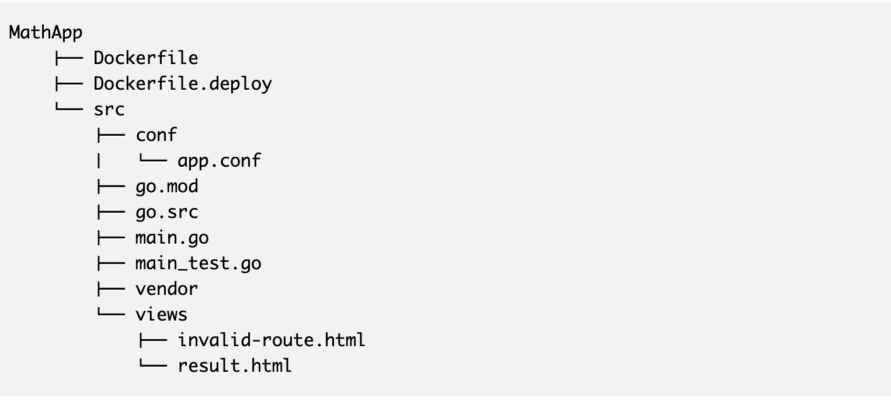

# Go Webapp #

A simple Golang Web app using Beego framework.

```
$ export GOFLAGS=-mod=vendor
$ export GO111MODULE=on
$ mkdir src
$ mkdir src/conf 
$ mkdir src/views
$ cd src
$ go mod init github.com/hgautam/go-docker
$ go mod download
$ go mod vendor
$ go mod verify
```




```
# this is Mac specifc command. Ubuntu might vary.
$ docker build --build-arg USER_ID=$(id -u) --build-arg GROUP_ID=$(id -u) -t mathapp .
cd ..
docker run -it --rm -p 8080:8080 -v $PWD/src:/go/src/mathapp mathapp
```
